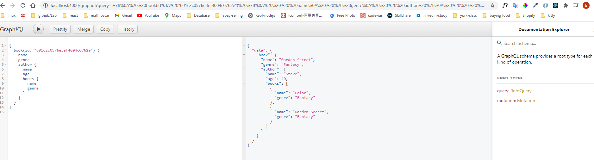
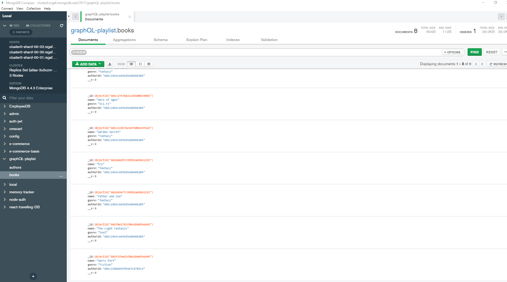

### React-graphql-book-list Server side

frontend repo: react-graphql-book-playlist-frontend

2021-2-4

```
npm run dev
```

PORT = 4000

to open grapiql window:
URL: localhost:4000/graphql

**Backend:graphql+mongoDB**

- npm lodash for loop an array
- relationship of types


<br>


